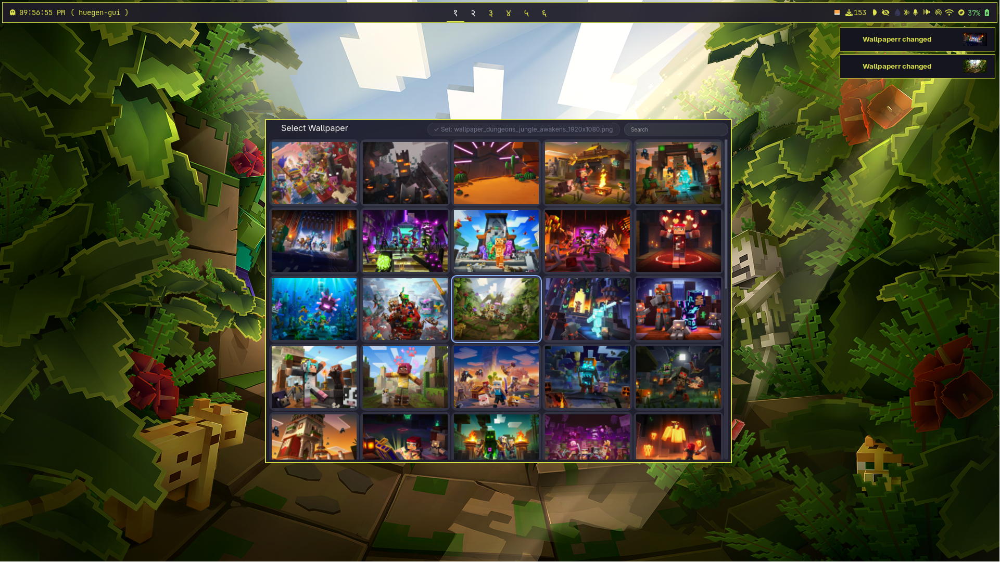

## Huegen GUI ( Beta )

A lightweight, keyboard-friendly wallpaper picker built with PySide6. It scans a directory for images, shows them in a responsive grid with lazy-loading thumbnails, and runs your configured command to set the selected wallpaper.

### Abbreaviations
list of abbreaviations that will be used along this README, because i'm too lazy to write letters
> WPT - wallpaper tool, program that sets your wallpaper

<center>
  
</center>

### Features

- Responsive grid with cropped thumbnails
- Lazy loading in batches for smooth scrolling
- Fast search-as-you-type filtering by filename
- Keyboard navigation (arrows) and quick apply (Enter/Space)
- `pywal` integration
- MP4 wallpapers suport(your wallpaper tool need to support .WEBP wallpapers)

### Requirements

- Python 3.9+ (tested on Linux; works on Wayland/X11 depending on wallpaper tool)
- PySide6
- A WPT available on your system (e.g., `feh`, `swww`, `hyprpaper`, `swaybg`, `nitrogen`, `gsettings`)
- `ffmpeg` and `libwebp` (optional, if you will be setting mp4 wallpapers)
- `walpy` or `walpy16`

### Install

```bash
python -m venv .venv
source .venv/bin/activate
pip install PySide6
```

### Run

```bash
cd src
python huegen-gui.py
```

On first run, a default `config.json` will be created next to the script. Edit it to point to your wallpapers directory and set your preferred wallpaper command.

### Configuration (`config.json`)

Keys:

- `wallpaper_dir` (string, required): Directory containing your image files.
- `wallpaper_command` (string, required): Command to set the wallpaper. Use `{path}` or `<selected image path>` as the placeholder for the image file path.
- `thumbnail_size` (number, optional): Base size used to generate thumbnails (default: 180).
- `webp_output_fps` (number, optional, default is 30): Determines how much fps your converted .MP4 wallpaper will have

Example:

```json
{
  "wallpaper_dir": "/home/you/Pictures/Wallpapers",
  "wallpaper_command": "feh --bg-scale {path}",
  "thumbnail_size": 180,
  "webp_output_fps": 30
}
```

Wallpaper command examples:

- feh: `feh --bg-scale {path}`
- swww (Wayland + the best MP4 support): `swww img {path}`
- hyprpaper: `hyprctl hyprpaper wallpaper ,{path}`
- swaybg: `swaybg -i {path} -m fill`
- nitrogen: `nitrogen --set-zoom-fill {path}`
- gsettings (GNOME): `gsettings set org.gnome.desktop.background picture-uri file://{path}`

Note: The app replaces both `{path}` and `<selected image path>` with the file path for convenience.

### Keyboard Shortcuts

- Arrow keys: Navigate between thumbnails
- Enter/Space: Apply selected wallpaper (runs your command)
- Start typing: Focuses the search box automatically

### Project Structure

```
huegen-gui/
  app.py           # Main application widget (UI + logic)
  widgets.py       # Reusable UI widgets (ClickableLabel, FlexGridWidget)
  image_loader.py  # Background QThread for loading/scaling images
  huegen.py        # Entry point (creates config if missing, starts app)
  config.json      # User configuration (created on first run)
```

### Development

- Run with `python huegen.py` from the project root.
- UI components live in `widgets.py`.
- Image loading is isolated in `image_loader.py`.
- App coordination and behaviors (search, lazy-load, command exec) are in `app.py`.

### Troubleshooting

- No images appear:
  - Ensure `wallpaper_dir` exists and contains files with extensions: .png, .jpg, .jpeg, .bmp, .webp, .tiff, .tif
  - Check permissions to read the directory.
- Command does nothing or fails:
  - Verify the command works in your terminal first (replace `{path}` with an actual file path).
  - Some environments (e.g., Wayland) require specific tools or session-specific flags.
  - Inspect stdout/stderr printed to the terminal for error messages.
- Performance issues with huge directories:
  - Reduce `thumbnail_size`.
  - Keep wallpapers in a dedicated directory rather than a giant mixed folder.

# 🔧Troubleshooting
> MP4 video refuses to set as wallpaper
- check if you have `ffmpeg` and `libwebp` installed
- check if you're WPT have webp support

### License

MIT (or your preferred license). Update this section as appropriate.
